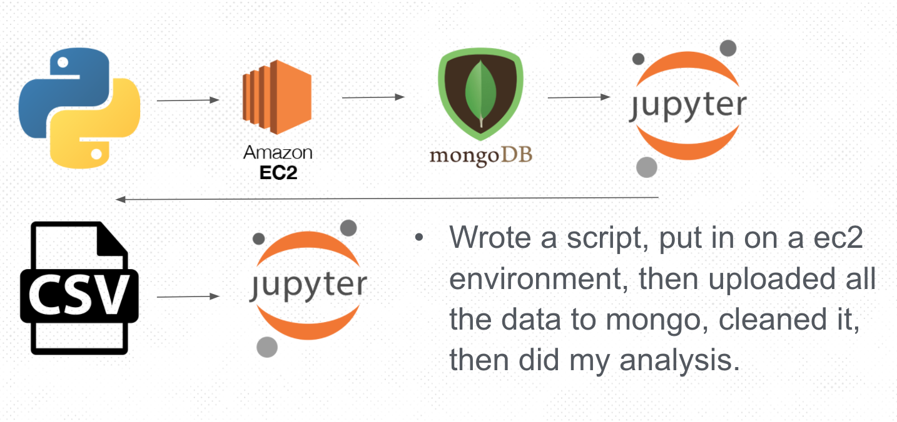

# StockX - Predict Resell Price of a Shoe

Would you spend $3,000 on a shoe? Some people do! That price is not the retail price, but the resell after market value. I got this idea after speaking with a friend who does this for a liivng. He buys (he has a friend that works a shoe store and holds a pair for him, so he has the inside scoop. Most people don't!) very limited released shoes or a shoes he thinks will resell very high. He reads a bunch or shoe blogs and articles that are up with the current trends to get insights on which shoe to try and get. Below are a few of those blogs if you are interested. 

Sneaker Blogs:
* [Nice Kicks](https://www.nicekicks.com/)
* [High Snobiety](https://www.highsnobiety.com/sneakers/)
* [Flight Club](https://www.flightclub.com/)

The popular buy and sell site stockx is where my data comes from. You can check out the site [here](https://stockx.com/). This is by far the most popular site for this buy and resell market. Early investors included rapper Eminem and model Karlie Kloss, but the site was founded by Dan Gilbert, the owner of the Cleveland Cavaliers. Just to give you an idea of how much this industry makes forbes estimated all sales of aftermarket reached 2 billion last year. 

Note: This work originated as a Capstone project for the Data Science Immersive curriculum at Galvanize in December 2019. The efforts are continuing.

# Background

I've seen a few other models developed for this, but everyything has been very broad, and the data has been very limited. The original thought was trying to predict the price for any shoe on the site, but due to my data collection restraints I narrowed it down to just two types of brands. Addias and Nike. Within those two brands, there are two sub-brands called "Yeezy" and "Off-White". My dataset contains only those two types of shoes. 

There are so many styles and types that it would be very difficult to try and predict the price for all shoes. The biggest benefit of a model that predicts properly would be useful for "Sneaker Heads" to see what they could expect on their investment on these high valued items. 

# Procedures followed

This project uses data gathered from the stockx website [here](https://stockx.com/news/the-2019-data-contest/). Each row of data is a shoe that was sold from the years 2017 to early 2019 and the features that are the type of shoe, size, color, the state which it was sold to, and the sale price. 

The features are consist of: 
* Order Date
* Brand
* Shoe
* Sale Price 
* Retail Price
* Release Date 
* Shoe Size
* Buyer Region
* Order year
* Order month 
* Order day
* Release year
* Release month
* Release day
* average_sale_price
* shoe_premium

 
  <b>Figure 1:</b> Workflow and Tools

 
## Data Cleaning: 
My data cleaning process wasn't too bad. There were a few columns that had characters mixed with numbers so I had to deal with that small issues. There were also some data types that were object that needed to be swichted to datetime and then split on that date to get month ordered, day ordered, and year ordered. 

### Feature engineering

After trying to run a regression on the entire dataset my model was not very intiative. So after thinking it over, I wanted to simplify my model. My entire dataset consisted of about 50 different unique shoes. Below are the different types of shoes that are for each brand. Even though off-white had more different styles, the yeezy brand and far more obervations. After filtering by brand and then shoe count, I took the shoe that had the highest count of every style and tried to predict that one shoe's resell price. 

Besides deciding to reduce my dataset to one shoe, I also calculated the mark up and the days the shoe was bought from the release date. My new dataframe can be seen below. 

### Models Used
Linear Regression, Lasso Regression ,and Random Forest Regession resulted in a MSE from 83.777, 83.690, 84.697.
  
